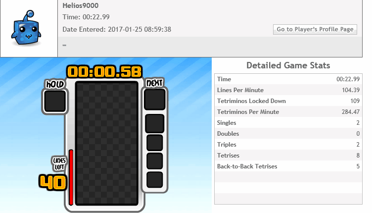
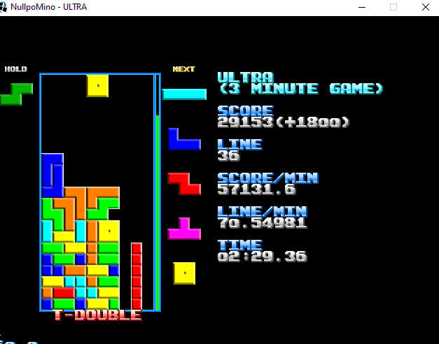

# Ztacker

**Ztacker** is a bot that uses [ST stacking](https://www.youtube.com/watch?v=-LJt-sXe_XA) to maximise its score in the Tetris *Ultra* game mode.

## About Ztacker

### Ultra

In *Ultra* the goal is to achieve the highest score possible in a 2-minute time span. Ztacker does this by searching all potential playfield combinations derived from the current active piece and those in the queue. The kinds of moves that are generated for the search are constrained by the play strategy, which defaults to ST stacking. Ztacker will estimate the value of these potential playfield positions and then choose the move that yields the highest expected value. Once it has found the best move, it executes it in the most efficient way possible so as to conserve time.

### Sprint

While it's primary purpose was to play *Ultra*, due to the fast and precise nature of computer inputs, it did exceedingly well at the *Sprint* game mode. In this game mode the player is tasked with clearing 40 lines as fast as possible. Due to the different nature of the game mode a different strategy than ST stacking was needed. For lack of a better term I have referred to it as "Playing Forever", as in theory this technique will allow an optimal player to keep playing indefinately. Ztacker can change the way it plays by changing it's move generation strategy and playfield evaluation function. In this regard it could be modified to play any Tetris game mode.

Originally developed to play on [Tetris Friends](https://tetrisfriends.com/), Ztacker was adapted for [Nullpomino](https://github.com/nullpomino/nullpomino) following the shutdown of Tetris Friends in 2019. 

Ztacker held the fastest time on Tetris Friends for the *Sprint* game mode, clearing 40 lines in 22.99 seconds. That's a rate of over 100 lines per minute.

## How It Works

### Reading The Grid
Based on the assumption that there is no API to communicate with the Tetris software, Ztacker resorts to taking snapshots of the section of the screen containing the Tetris playfield. It then pin points the middle of each cell in the playfield grid and based on the colour of each cell derives the whole state of the grid. For efficiency in the search step this grid is modelled as a handful of longs whose bits represent whether a cell is occupied or not.

### The Decision Making Process
Ztacker receives the state of the grid along with the active and upcoming pieces. With this it performs a depth first search carrying out 
each possible permutation of legal moves with the active piece, guided by the play strategy. It then makes the next piece in line the active piece. This is repeated recursively until no more pieces are left in the queue, at which point the value of the grid is evaluated. Finally the move that yields the highest expected value leaf node is chosen.

The value of a grid configuration is based on various factors, including how flat the mid section of the board is, how balanced the L and S pieces are, how close to each other the three divisions of the grid are, etc. Losing a game is assigned a value of negative infinity.

### Communicating Back
Since Ztacker is constrained by not being able to communicate with the Tetris software directly, it must attempt to do so as a human would. It cannot just say move this piece here as a single API or function call, rather it communicates its moves through key strokes. So while the search procedure gives us back the best move, Ztacekr must then convert it into a series of key presses and releases. Executing the move involves a continous feedback loop between the bot assesing the state of the playfield and adjusting its keypresses accordingly. Once the bot has checked, by comparing the grid position with it's intended move, that a move has been completed succesfully it will initiate another search.

## Why Ztacker?

The bot chooses to horizontally mirror the way it normally uses pieces if it finds that more advantageous. In this case the role of the S piece is met by the Z piece and ST stacking becomes ZT stacking.

"ZT stacker" → "Ztacker" (or ZTK for short)

## Project History

### Original Development
Ztacker was first developed in 2017, born out of a love for both Tetris and programming.

### Migration to GitHub
The project, along with its documentation, was uploaded to GitHub in 2020. This move was intended to archive the work and make it accessible to the public.
